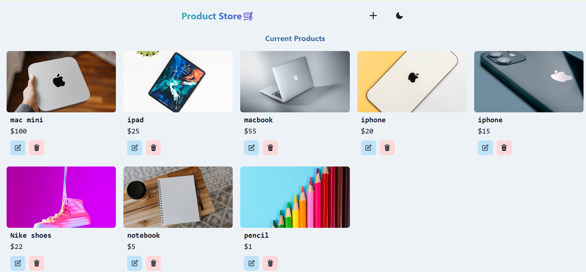

# Product Store MERN App 🛍️

A full-stack product store app built with the MERN stack (MongoDB, Express, React, Node.js).

## Demo 🎥

🔗 [Live Demo](https://product-store-app-0rwc.onrender.com/)

### Screenshot:



## Installation 🔧

### 1️⃣ Clone the repository

```bash
git clone https://github.com/IndubalaSV/product-store-MERN_App.git
cd product-store-MERN_App
```

### 2️⃣ Install dependencies

```
npm install
cd frontend && npm install
```

### 3️⃣Setup Environment variables 🌍

```
MONGO_URI=your_mongo_db_uri
ENVIRONMENT=production
PORT=5000
```

### 4️⃣ Run the development server

```
npm run dev
```
